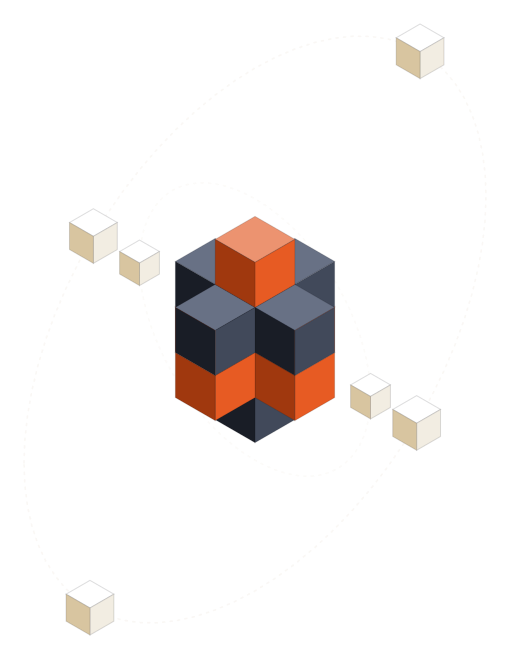

# Carbox



Carbox is a JAX-accelerated astrochemical kinetic reaction network
simulator built on **JAX**, **Diffrax**, and **Equinox**. Point it at a
reaction network file (UCLCHEM, UMIST, or LATENT-TGAS format), and it
parses the network, JIT-compiles it into a JAX-traceable ODE, and
integrates species abundances over time under whichever physical
conditions you choose -- a static cloud, a circumstellar outflow, or a
custom model of your own.

This site covers the parts of Carbox that are easiest to get wrong by
reading the source alone -- configuration, physics models, thermal
balance, and output files -- and pulls the API reference straight from the
code's docstrings, so it can't drift out of sync with the implementation.
For the underlying chemistry (reaction types, network file formats), see
the [UCLCHEM documentation](https://uclchem.github.io/); Carbox reads the
same network conventions.

## Installation

```bash
pip install .                # core library + `carbox-sim` CLI
pip install -e .[dev]         # + pytest, pre-commit, ruff, for development
pip install -e .[docs]        # + mkdocs, to build this site locally
```

See the repository [README](https://github.com/gijsvermarien/carbox#readme)
for the full installation matrix (including the `benchmarks` extra) and CLI
usage; [CONTRIBUTING.md](https://github.com/gijsvermarien/carbox/blob/main/CONTRIBUTING.md)
covers setting up a development environment.

## Quickstart

```python
from carbox import SimulationConfig, run_simulation

config = SimulationConfig(
    number_density=1e4,
    temperature=50.0,
    t_end=1e6,
    run_name="example_run",
)

results = run_simulation("data/network.csv", config, format_type="latent_tgas")
solution = results["solution"]
network = results["network"]
```

The same run from the command line:

```bash
carbox-sim --input data/network.csv --format latent_tgas
```

## Where to go next

- **[Configuration](configuration.md)** -- the settings you're likely to
  change: physical conditions, initial abundances, solver tolerances, and
  what gets written to disk.
- **[Physics models](physics.md)** -- how density, temperature, and
  extinction are prescribed (or, for thermal balance, integrated) over
  time; static clouds vs. CSE outflows vs. writing your own.
- **[Thermal balance](thermal_balance.md)** -- letting radiative cooling
  feed back into an integrated gas temperature instead of holding it fixed.
- **[Output files](outputs.md)** -- what each output CSV/JSON contains and
  how to read it.
- **API reference** -- generated from docstrings via
  [mkdocstrings](https://mkdocstrings.github.io/); start at
  [carbox.config](api/config.md) or [carbox.network](api/network.md).

## Building these docs

```bash
.conda/bin/pip install -e .[docs]
.conda/bin/mkdocs serve   # live preview at http://127.0.0.1:8000
.conda/bin/mkdocs build   # static site in site/
```
